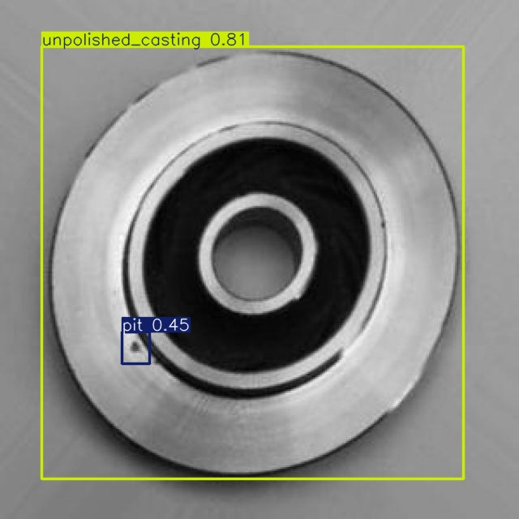
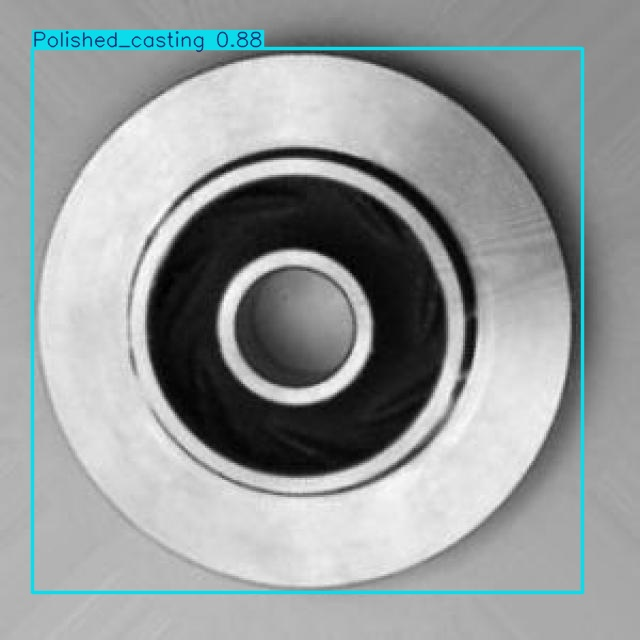

# Informe de Resultados — Detección de Defectos en Piezas de Fundición CNC con YOLOv8

**Autor:** Brian Prado — Ingeniería Mecatrónica
**Asignatura:** Visión Artificial
**Docente:** Jose Ramón Navarro
**Fecha:** 19 de junio de 2026
**Repositorio:** <https://github.com/BrianPrado-Dev/Vision-Artificial>

---

## 1. Objetivo

Entrenar y evaluar un modelo de detección de objetos de la familia **YOLOv8** capaz de
identificar defectos en piezas de fundición CNC (rebabas, grietas, picaduras, rayones y
deformaciones) y de distinguir el estado del acabado superficial de la pieza, como base
para un sistema de inspección de calidad automatizado en una línea de producción.

## 2. Configuración experimental

El modelo se entrenó en la nube (Google Colab) sobre una GPU **NVIDIA Tesla T4**, partiendo
de los pesos preentrenados **YOLOv8s** (aprendizaje por transferencia desde el dataset COCO).

| Parámetro | Valor |
|-----------|-------|
| Arquitectura | YOLOv8s (small) |
| Dataset | casting-detection v10 (Roboflow Universe) |
| Imágenes (train / val / test) | 3 659 / 391 / 220 |
| Nº de clases | 8 |
| Épocas | 50 |
| Resolución de entrada | 640 × 640 px |
| Tamaño de lote (batch) | 16 |
| Optimizador | SGD (configuración automática de Ultralytics) |
| Hardware | GPU NVIDIA Tesla T4 (16 GB) |

Las 8 clases del dataset son: `Casting_burr`, `Polished_casting`, `burr`, `crack`, `pit`,
`scratch`, `strain` y `unpolished_casting`.

## 3. Métricas globales de validación

> Valores aproximados leídos de las gráficas de entrenamiento. Los valores exactos se
> encuentran en `runs/entrenamiento/defectos_yolov8/results.csv` (última fila).

| Métrica | Valor aprox. | Interpretación |
|---------|--------------|----------------|
| **Precisión (Precision)** | ≈ 0.80 | De cada 100 defectos detectados, ~80 eran correctos (pocos falsos positivos). |
| **Exhaustividad (Recall)** | ≈ 0.74 | El modelo encontró ~74 % de los defectos realmente presentes. |
| **mAP@0.5** | ≈ 0.78 | Precisión media con solapamiento IoU ≥ 0.5. Buena capacidad de detección. |
| **mAP@0.5:0.95** | ≈ 0.57 | Métrica estricta (promedio sobre varios umbrales IoU). Localización correcta pero mejorable. |

El valor de **mAP@0.5 ≈ 0.78** indica un desempeño satisfactorio para una aplicación de
inspección industrial. La diferencia respecto al **mAP@0.5:0.95 ≈ 0.57** es esperable y
señala que el ajuste fino de las cajas delimitadoras (localización exacta) constituye el
principal margen de mejora.

## 4. Curvas de entrenamiento

*Figura 1. Evolución de las funciones de pérdida (box, cls, dfl) y de las métricas
(precision, recall, mAP) a lo largo de las 50 épocas.*

- **Convergencia:** las tres funciones de pérdida de entrenamiento (`box_loss`, `cls_loss`,
  `dfl_loss`) descienden de forma sostenida, lo que confirma un aprendizaje correcto y estable.
- **Salto en la época 40:** el repunte visible en `box_loss` y `dfl_loss` alrededor de la
  época 40 **no es un error**, sino la desactivación automática de la augmentación *mosaic*
  (`close_mosaic`), comportamiento estándar de YOLOv8 que afina el modelo sobre imágenes
  reales (sin recortes sintéticos) durante las últimas 10 épocas.
- **Generalización:** las pérdidas de validación se estabilizan sin dispararse, por lo que
  **no se observa sobreajuste severo**. Las métricas se estabilizan a partir de la época
  ~30-35, indicando que el modelo había convergido.

## 5. Matriz de confusión

*Figura 2. Matriz de confusión (filas = predicho, columnas = real).*

El desempeño es heterogéneo entre clases:

| Clase | Aciertos | Recall aprox. | Valoración |
|-------|----------|---------------|------------|
| `Polished_casting` | 202 | ≈ 91 % | Excelente |
| `Casting_burr` | 88 | ≈ 99 % | Excelente |
| `pit` (picadura) | 75 | ≈ 85 % | Bueno |
| `unpolished_casting` | 65 | ≈ 83 % | Bueno |
| `crack` (grieta) | 126 | ≈ 69 % | Aceptable |
| `strain` (deformación) | 5 | ≈ 62 % | Limitado (pocas muestras) |
| `scratch` (rayón) | 116 | ≈ 42 % | Deficiente |
| `burr` | 0 | — | Sin muestras de prueba |

**Hallazgos principales:**

1. **Clases de "estado de pieza" muy robustas:** `Polished_casting` (202 aciertos) y
   `Casting_burr` (88) se detectan casi sin error. El sistema distingue con fiabilidad una
   pieza conforme de una con rebaba de fundición.
2. **Principal confusión: `scratch` ↔ fondo (*background*).** 144 rayones reales se
   clasificaron como fondo (no detectados) y 86 fondos se detectaron como rayón (falsos
   positivos). Es coherente con la naturaleza del defecto: los rayones son finos y de bajo
   contraste, fáciles de confundir con la textura de la superficie.
3. **Confusión `crack` ↔ `pit`:** 26 grietas se predijeron como picaduras y 11 picaduras
   como grietas, razonable dado que ambos son defectos pequeños y localizados.
4. **Clase `burr` colapsada:** el modelo nunca predice `burr` y prácticamente no hay
   instancias de prueba. Esto se debe a la **redundancia de etiquetas del dataset
   comunitario** (`burr` vs `Casting_burr`), donde casi todos los ejemplos quedaron
   asignados a `Casting_burr`.
5. **Desbalance de clases:** `strain` y `burr` están muy poco representadas, lo que limita
   su evaluación y su desempeño.

## 6. Ejemplos de inferencia

A continuación se muestran ejemplos reales de la inferencia del modelo sobre el conjunto de
prueba (las 220 imágenes anotadas están disponibles en `evidencias/predicciones/`).

*Figura 3. Detección sobre una pieza con defecto (picadura y acabado sin pulir).*

*Figura 4. Detección sobre una pieza conforme (acabado pulido).*

## 7. Discusión y limitaciones

- El dataset es de origen **comunitario**, con etiquetas solapadas (`burr`/`Casting_burr`,
  `Polished`/`unpolished`) y desbalance de clases, lo que penaliza las métricas globales
  pese al buen comportamiento en las clases principales.
- Los defectos sutiles (`scratch`) requieren mayor resolución o iluminación controlada
  (como la iluminación rasante descrita en el caso de estudio) para mejorar su detección.
- El `mAP@0.5:0.95` indica que la localización de cajas podría afinarse con más épocas de
  entrenamiento o con un modelo de mayor capacidad (YOLOv8m).

## 8. Conclusiones

El modelo YOLOv8s entrenado demuestra ser **viable para la inspección automatizada de
piezas de fundición**, con un desempeño sobresaliente en la discriminación entre piezas
conformes y con rebaba, y un **mAP@0.5 ≈ 0.78**. Las principales líneas de mejora son:

1. **Equilibrar y depurar el dataset** (unificar clases redundantes; añadir muestras de
   `scratch` y `strain`).
2. **Aumentar las épocas o el tamaño del modelo** (p. ej. YOLOv8m) para mejorar la
   localización (mAP@0.5:0.95).
3. **Mejorar la adquisición de imagen** (iluminación rasante, mayor resolución) para
   realzar los defectos de bajo contraste.

---

*Informe generado para la asignatura de Visión Artificial — Ingeniería Mecatrónica.*
